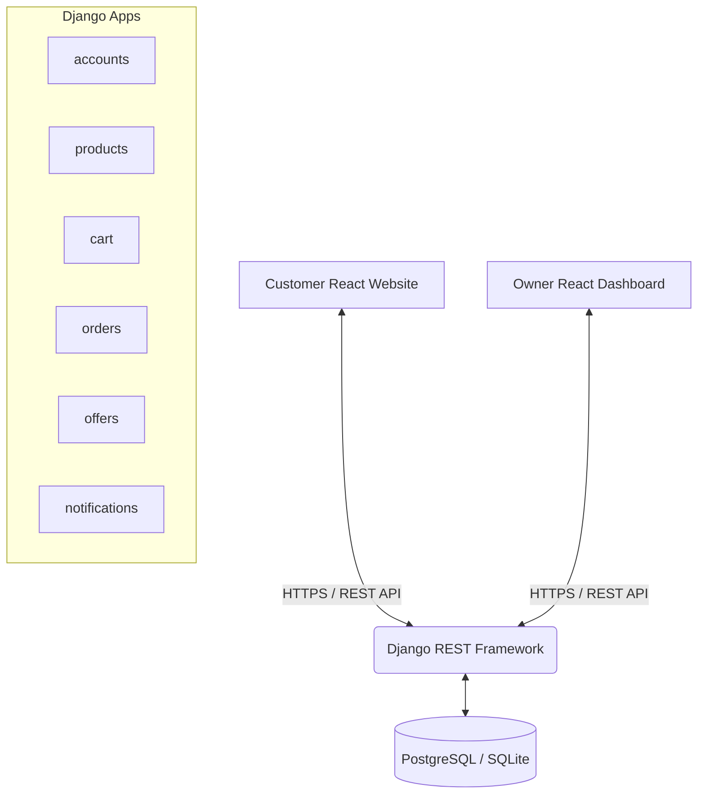
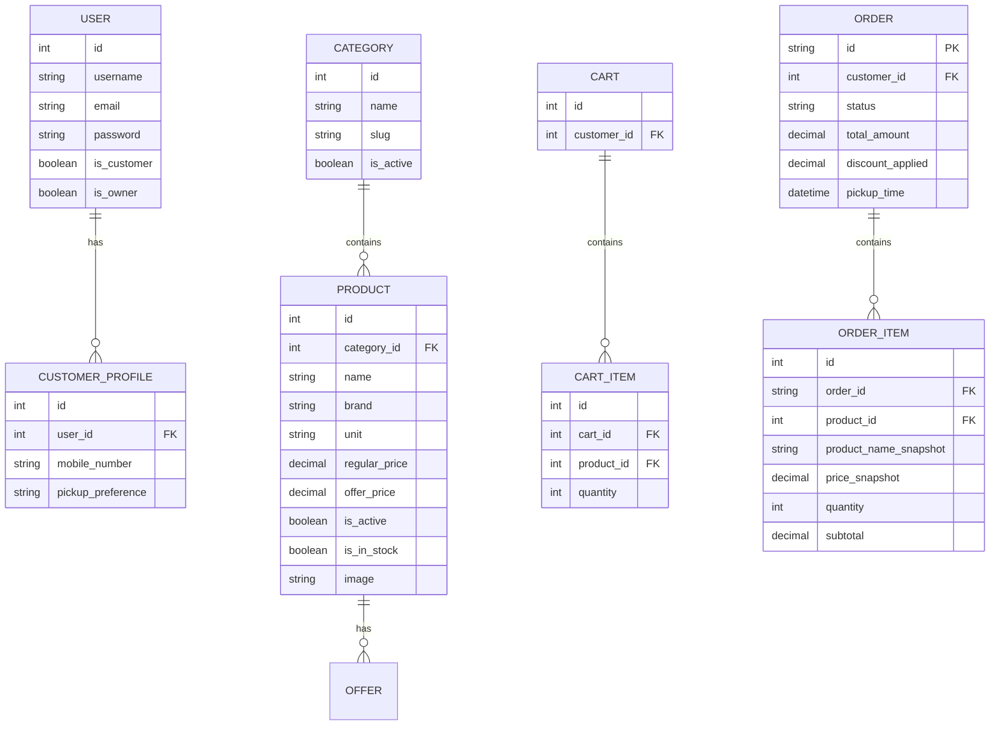
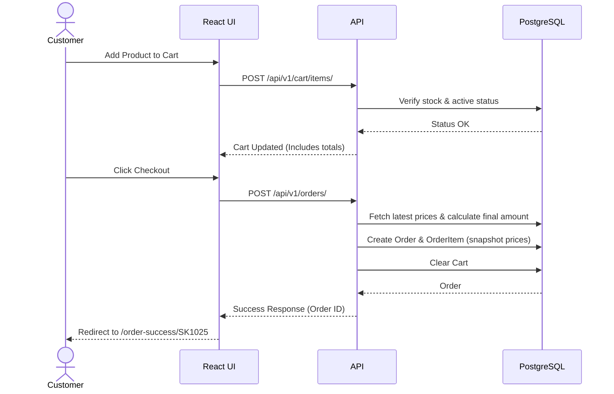
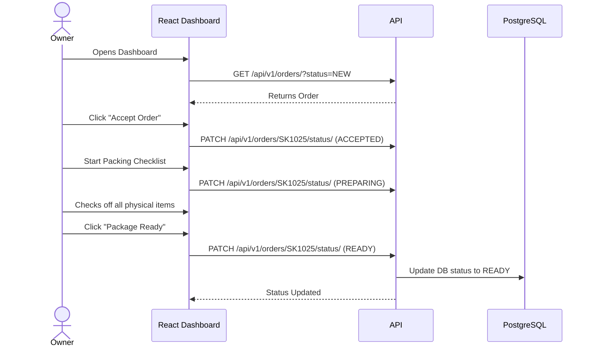

# Smart Kirana - Complete Project Documentation

This document serves as the absolute source of truth for the **Smart Kirana** project. It is designed to be read by human developers and AI coding assistants (like GitHub Copilot, Cursor, or Codex) to gain immediate, comprehensive understanding of the project's architecture, rules, and current state.

---

## 1. Project Vision & Purpose
**Smart Kirana** is a production-quality V1 web application designed to digitize a local Kirana (grocery) shop. It connects customers and the shop owner through a single web application with two distinct experiences:
1. **Customer Website**: A polished, modern, mobile-first quick-commerce experience for browsing products, adding to cart, and placing store-pickup orders.
2. **Owner Admin Portal**: A SaaS-style dashboard for the shop owner to manage products, categories, offers, and process orders via an interactive packing checklist.

**V1 Constraints & Exclusions:**
- **Store Pickup ONLY:** No home delivery logistics.
- **Pay at Store ONLY:** No online payment gateways.
- **No Microservices:** The app is a modular monolith.
- **No Native Apps:** Mobile-responsive web only, but the backend uses an API-first REST architecture to support Android in the future.

---

## 2. Tech Stack & Architecture

- **Backend:** Python, Django 5.x, Django REST Framework (DRF)
- **Database:** PostgreSQL (V1 local development falls back to SQLite via `dj-database-url`)
- **Authentication:** `djangorestframework-simplejwt` for secure API token auth.
- **Frontend:** React 18, Vite, React Router, Tailwind CSS (v4), Axios.

### Architecture Diagram


### Future Architecture (Post-V1)
The backend is strictly API-first so that it can be reused **unmodified** for future native Android or iOS applications.
- **Phase 2 (Mobile Apps):** Both the React Website and a future Native Android App will consume the exact same Django REST APIs. *Do not create a separate backend for mobile.*
- **Phase 3 (Delivery Logistics):** A future Delivery Staff App will also connect to this same monolithic backend, which is why the current architecture must keep roles strict and APIs modular.

---

## 3. Database Schema & Data Models

The system maintains absolute data integrity, especially for orders (prices and product names are snapshotted at the time of order creation).



---

## 4. Sequence Diagrams & System Flows

### 4.1. Order Placement Flow (Customer)
This diagram illustrates the secure backend calculation pattern required for V1.


### 4.2. Order Fulfillment Flow (Owner)
This diagram illustrates the state transitions an Owner performs using the Packing Checklist.


---

## 5. Authentication Flow & Roles

There are two strict roles:
1. **Customer (`is_customer=True`)**:
   - Can sign up via public API `/api/v1/auth/signup/`.
   - Can only read active products.
   - Can only access their own Cart and Orders.
2. **Owner (`is_owner=True`)**:
   - Cannot sign up publicly (created via Django Admin or CLI).
   - Has full CRUD access to products, categories, offers, and all orders.
   - Bypasses the `is_active` filter to see draft/hidden products.

**Token Auth:** Both roles use JWT (JSON Web Tokens). The frontend stores the access token and sends it as `Authorization: Bearer <token>` in Axios requests.

---

## 5. API Specification (RESTful)

### Auth (`accounts` app)
- `POST /api/v1/auth/signup/` - Creates User and CustomerProfile.
- `POST /api/v1/auth/login/` - Returns JWT Access and Refresh tokens.
- `POST /api/v1/auth/refresh/` - Refreshes JWT token.
- `GET/PATCH /api/v1/auth/profile/` - Manages customer profile data.

### Catalog (`products` app)
- `GET /api/v1/products/` - List products (supports `?search=`, `?category=`). Customers only see `is_active=True`.
- `GET /api/v1/products/:id/` - Product details.
- `POST/PUT/DELETE /api/v1/products/` - (Owner Only) Manage products.
- `GET /api/v1/categories/` - List categories.
- `POST/PUT/DELETE /api/v1/categories/` - (Owner Only) Manage categories.

### Future Endpoints (To be built)
- **Cart (`cart` app):** `GET /api/v1/cart/`, `POST /api/v1/cart/items/` (Must calculate totals strictly on the backend).
- **Orders (`orders` app):** `POST /api/v1/orders/` (Creates order, snapshots prices), `GET /api/v1/orders/` (List own orders), `PATCH /api/v1/orders/:id/status/` (Owner only state transitions).

---

## 6. UI/UX Design System & Frontend Guidelines

To maintain visual consistency and performance, the frontend MUST follow these guidelines:

**Design Tokens:**
- **Primary Brand Color:** Deep Green (`#16a34a` / `text-primary-600` / `bg-primary-600`).
- **Secondary/Action Color:** Indigo/Blue (`#4f46e5`) - Used primarily in the Owner Dashboard to visually distinguish it from the Customer Website.
- **Backgrounds:** Neutral Gray (`bg-gray-50`) for the app background, White (`bg-white`) for cards.
- **Status Colors:** Green (Success/Ready), Amber (Warning/Preparing), Blue (New Orders), Red (Error/Rejected).
- **Typography:** Modern Sans-serif (default Tailwind font).
- **Components:** High border-radius (`rounded-2xl` or `rounded-xl`), subtle shadows (`shadow-sm` or `shadow-md`), large touch targets (minimum 44px height for all buttons and inputs).

**Frontend State Management:**
- Use **React Context API** for lightweight global state (e.g., `AuthContext`, `CartContext`).
- **DO NOT introduce Redux.** Keep it simple.

---

## 7. How to Run the Project Locally

### 1. Backend (Django)
```bash
cd smart-kirana/backend
# Activate virtual environment (if you are using one)
# Windows: venv\Scripts\activate | Mac/Linux: source venv/bin/activate

# Install dependencies (if not already installed)
pip install django djangorestframework djangorestframework-simplejwt django-cors-headers django-filter pillow dj-database-url psycopg2-binary

# Run migrations (using default SQLite for local dev)
python manage.py migrate

# Create an owner account (superuser)
python manage.py createsuperuser

# Start the server (runs on http://localhost:8000)
python manage.py runserver
```

### 2. Frontend (React / Vite)
```bash
cd smart-kirana/frontend
# Install packages
npm install

# Start the Vite dev server (runs on http://localhost:5173)
npm run dev
```

---

## 8. Golden Rules for AI Agents & Future Developers
If you are an AI reading this file to continue coding, **YOU MUST OBEY THESE RULES**:

1. **NO BUSINESS LOGIC IN REACT:** The React frontend is purely for presentation. All price calculations, total calculations, discounts, and validations MUST happen in the Django backend. Never trust frontend calculations.
2. **MAINTAIN DATA SNAPSHOTS:** When generating the `OrderItem` models, you must copy the `price` and `name` from the Product at the time of checkout. Do not rely on `product.regular_price` for historical orders, because if the owner changes the price tomorrow, old orders must not be affected.
3. **DO NOT OVER-ENGINEER:** V1 does not have delivery, online payments, or microservices. Keep the architecture clean and simple.
4. **MOBILE FIRST UX:** The customer frontend must have large touch targets, minimal taps to add-to-cart, and a bottom sticky navigation bar on mobile devices.
5. **OWNER UI IS SEPARATE:** The Owner Dashboard uses the exact same React codebase but lives under the `/owner/*` routes. It should look like a dense, high-productivity SaaS dashboard, completely different from the Customer e-commerce view.

---

## 9. Current Folder Structure

```text
smart-kirana/
├── PROJECT_STATUS.md       # Task tracker and phase completion status
├── README.md               # This documentation file
├── backend/                # Django API
│   ├── manage.py
│   ├── config/             # Main Django settings and root URLs
│   ├── accounts/           # User models, profiles, auth APIs
│   ├── products/           # Categories, Products models and APIs
│   ├── cart/               # (Pending) Cart logic
│   ├── orders/             # (Pending) Order processing logic
│   ├── offers/             # (Pending) Discount engine
│   └── notifications/      # (Pending) Alerts for owner dashboard
└── frontend/               # React UI
    ├── package.json
    ├── vite.config.js
    ├── tailwind.config.js
    └── src/
        ├── App.jsx         # Root router
        ├── index.css       # Tailwind entry point
        └── ...             # React components
```
